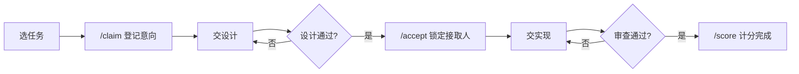

# 协作指南

适用于量潮实训基地技术和非技术人员的标准化协作指南  

> 方括号如 `[仓库 URL]` 是占位符；具体取值见该项目在 [任务清单](../../todo.md) 中的条目。  

## 流程速览

「是」继续，「否」回退。这张图只描述领取任务。  

## 领取任务 

1. 打开 [任务清单](../../todo.md)，选状态为可领取的任务，点击跳到 Issue 后阅读正文。
2. 在任务下单独一行评论 `/claim`。注：此时接取人仍空是正常的，因为任务还没被截取确认。
3. 在 [设计目录] 按 `_TEMPLATE.md` 写方案，文件名 `#[示例任务号]-[示例短英文].md`，不要塞完整代码。
4. 从 [默认分支] 开 `design/#[示例任务号]-[示例短英文]`，用「Design」模板提 PR，标题 `[Design] #[示例任务号] [示例标题]`，正文写 `Related to #[示例任务号]`；邮件主题为 `[Design] #[示例任务号] [你的 GitHub ID]`，附 Issue 链接、PR 链接与账号，发到 [审核通知邮箱]。
5. 等全部 [审核员] 通过评审后，[管理员] 才合并设计并 `/accept @你`。在此之前不要催，也不要开实现 PR。
6. 开 `feat/#[示例任务号]-[示例短英文]`，用「Implementation」模板提 PR，标题 `[Impl] #[示例任务号] [示例标题]`，正文写 `Fixes #[示例任务号]`，填贡献者声明与 AI 使用说明，并贴上代码、演示视频链接、至少 2 张截图。
7. [审核员] 各自在 PR 评论 `/通过` 后，[管理员] 合并并 `/score [示例积分]`。缺了就补完再 `/recheck`。

同一账号同时只能做 1 题，换题先 `/cancel`。同一账号同时只能有 1 个未关闭的 PR，开新 PR 前先关闭或合并旧的。不要把密钥写进代码、截图、视频或任务页。超过 30 天不更新会自动释放。设计 PR 不要写 `Fixes`，以免没做完就关任务。 

## 发布任务

1. 把 [任务清单模板](../specification/todo.md) 投喂给 AI，按模板生成一个 `##` 条目。相对路径是 `../specification/todo.md`。
2. 只改 [任务清单](../../todo.md)，把该条目追加进去，不要改规范或其他文件。
3. 对本仓库开 PR，请 [管理员] 和 [审核员] 按[初审流程(未写入)](#初审流程)审阅。
4. 合并后该条目才进入可领取任务中。

## 角色职能

- 课题发起者默认为 [管理员]；
- 全部 [审核员] 通过后，[管理员] 才可合并 PR；

| **角色** | **职责** |
| :-- | :-- | :-- |
| [管理员] | 接受设计、合并 PR、计分 |
| [审核员] | 审阅设计与实现、计分 |

## 命令速查

| **命令** | **发在哪** | **谁能用** | **作用** |
| :-- | :-- | :-- | :-- |
| `/claim` | 任务 Issue | 任意登录用户 | 登记意向，不写接取人 |
| `/accept @用户名` | 任务 Issue | 仅 [管理员] | 设计合并后批准，写入接取人 |
| `/cancel` `/release` | 任务 Issue | 认领人或 [管理员] | 放弃，接取人清空 |
| `/reject-claim` | 任务 Issue | 仅 [管理员] | 强制清空别人的认领 |
| `/score N` | 任务 Issue | [管理员] 或 [审核员] | 计分 |
| `/approve` | PR 评论 | 仅 [审核员] | 同意当前提交，全员通过后门禁变绿 |
| `/reject` | PR 评论 | 仅 [审核员] | 反对或撤回通过 |
| `/recheck` | PR 评论 | 作者或 [审核员] | 补材料后重跑检查 | 

## 积分规则

| **难度** | **积分** |
| :-- | --: |
| 简单 | 10～15 |
| 中等 | 25～35 |
| 难 | 50～60 |
| 特难 | 70～90 |

具体分数以任务 Issue 正文的积分字段为准。实现 PR 合并后由 [管理员] 在 Issue 评论 `/score N` 计分，[审核员] 也可记分，避免重复记分。  

## 常见问题

**Q：我 `/claim` 了，任务看板怎么还没有我的名字？**  
A：正常。要等设计被合并，且 [管理员] `/accept @你` 之后才会写入。  

**Q：可以同时接两道题吗？**  
A：不可以。先 `/cancel` 再换题。  

**Q：我已经有一个未关闭的 PR，还能再开吗？**  
A：不可以。先关闭或合并旧的 PR。  

**Q：一个月没推 PR 会怎样？**  
A：系统自动释放，接取人清空，任务重开。  

**Q：设计还没合并，[管理员] 能 `/accept` 吗？**  
A：不能。机器人会因未找到已合并的设计 PR 而拒绝。  
